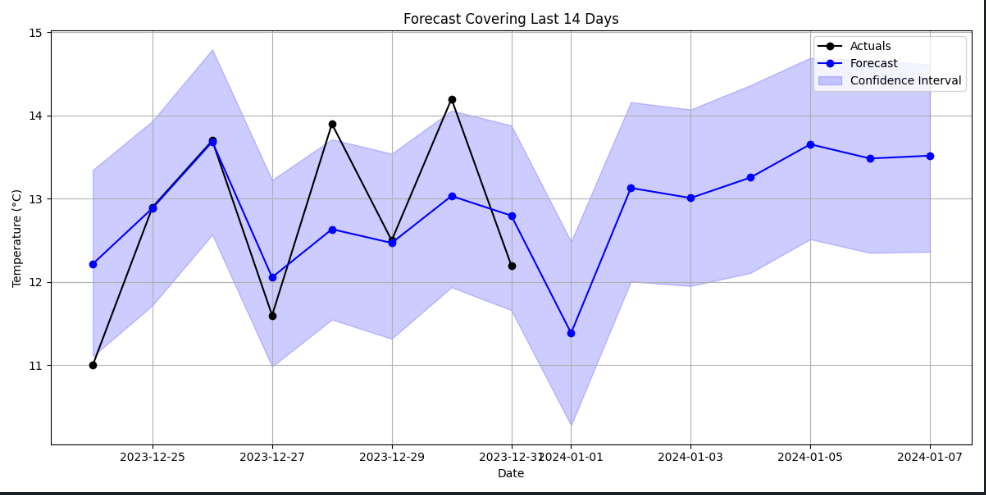

# Weather Forecast Program

## 📁 Submitted Files

- `forecast.py`: updated python file
- `forecast.csv`: weather forecast for the next 7 days, from the last date of the training data 
- `forecast.png`: image showing weather forecast for the next 7 days, from the last date of the training data
- `test_weather_forecast.py`: weather forecast test file 

