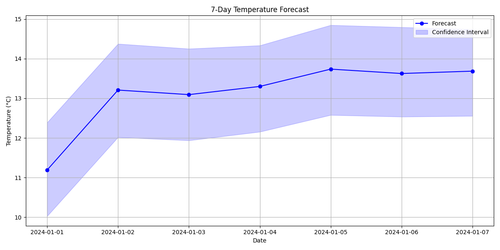
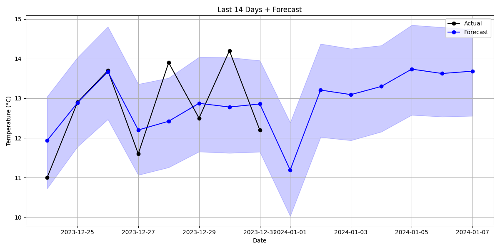
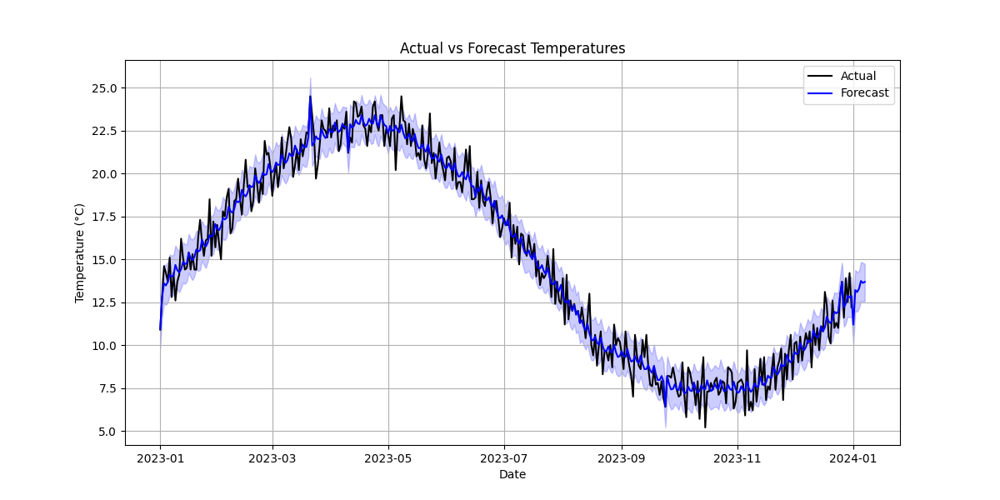
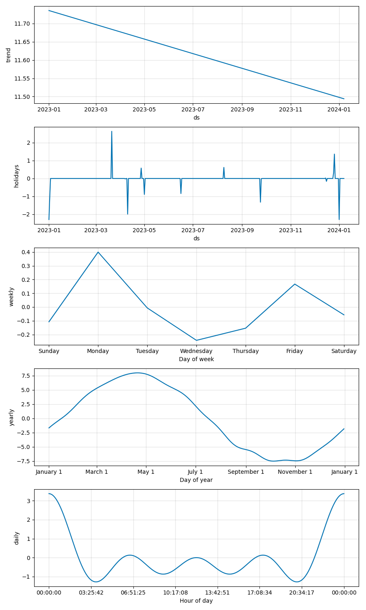

## 🌤️ Weather Temperature Forecasting with Prophet

A command-line Python program that uses Facebook's Prophet library for time series forecasting of daily temperatures.
This tool supports forecasting future temperatures, tuning model parameters with Optuna, incorporating additional
regressors, and visualizing forecasts with confidence intervals.

## 📦 Project Structure
```
.
├── forecast.py                     # Main forecasting script
├── requirements.txt                # Dependencies
├── examples/
│   ├── weather_data.csv            # Sample input data
│   ├── forecast.csv                # Sample output (7 days)
│   ├── forecast.png                # Forecast-only visualization (7 days)
│   ├── forecast_actuals.png        # Comparison visualization, Forecast with previous 7 days of actuals
│   ├── forecast_actuals_full_range.png  # Forecast with full historical context
│   └── components.png              # Prophet model components plot
├── tests/
│   └── test_weather_forecast.py    # Unit tests
└── readme.md
```

## 📋 Features

- [ ] Forecast temperatures using Prophet for any number of future days.
- [ ] Custom CLI with flexible arguments for input CSV, forecast periods, regressors, etc.
- [ ] Robust error handling and input validation
- [ ] Test suite with pytest to validate model behavior and CLI functionality
- [ ] Custom seasonality detection (daily, weekly, yearly)
- [ ] Holiday effects modeling (South African holidays)
- [ ] Hyperparameter tuning with Optuna for optimal performance
- [ ] Multiple visualization outputs:
  - Short-term forecasts
  - Actual vs forecasted comparisons
  - Trend and seasonality components
- [ ] Regressor support for additional predictive variables

## 📦 Installation

1. Clone the repository:
   ```bash
   git clone https://github.com/bender-cmd/weather-forecaster.git
   cd weather-forecast
   git checkout submissions/dalitso

2. Create and activate a virtual environment:
   ```bash
   python -m venv venv
   source venv/bin/activate  # Linux/Mac
   venv\Scripts\activate    # Windows

3. Install dependencies:
   ```bash
   pip install -r requirements.txt


## 🖥️ Usage

- [ ] Basic forecast:

      python forecast.py --input weather_data.csv

- [ ] 7-day forecast with component plots:

      python forecast.py --input weather_data.csv --periods 7 --plot-components

- [ ] With humidity and pressure as regressor:

      python forecast.py --input weather_data.csv --use-regressor humidity pressure

- [ ] Available Arguments:

      --input <file.csv>          Path to input CSV (required)
      --output <forecast.csv>     Save forecast to CSV [default: None]
      --periods <days>            Days to forecast [default: 7]
      --use-regressor <col>       Add regressor columns (e.g., humidity)
      --plot-components           Generate component plots
      --no-tuning                 Skip hyperparameter optimization
      --trials <n>                Hyperparameter trials [default: 30]


## 📊 Example Outputs



Shows the forecasted temperatures for the next 7 days with confidence intervals.



Includes both the recent historical temperatures and the forecast.



Displays the entire training data along with the forecast.



Breakdown of the trend, weekly, and yearly seasonality components (if enabled).


## 📁 Input Format

Input CSV must contain at least the following columns:
```
Column	            Description

ds	                Date (YYYY-MM-DD)
temperature_celsius	Daily average temperature (°C)
```
Example:
```
ds,temperature_celsius
2024-01-01,26.1
2024-01-02,25.4
...
```

## 🧪 Running Tests

    pytest test_weather_forecast.py

Tests cover:

- Forecast generation
- CSV parsing and validation
- CLI argument behavior
- Regression logic


## ⚙️ Dependencies

- prophet
- optuna
- pandas
- matplotlib
- pytest


## 📌 Notes

- Ensure your input CSV has no missing dates or temperature values.

- Add regressors to improve forecast quality, especially for non-seasonal patterns.

- Component plots are optional and can be toggled with --plot-components.


