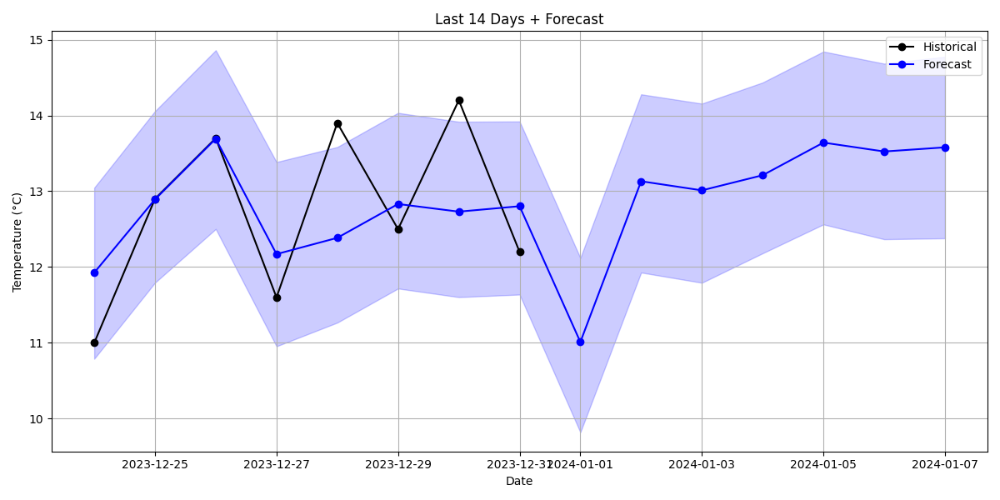
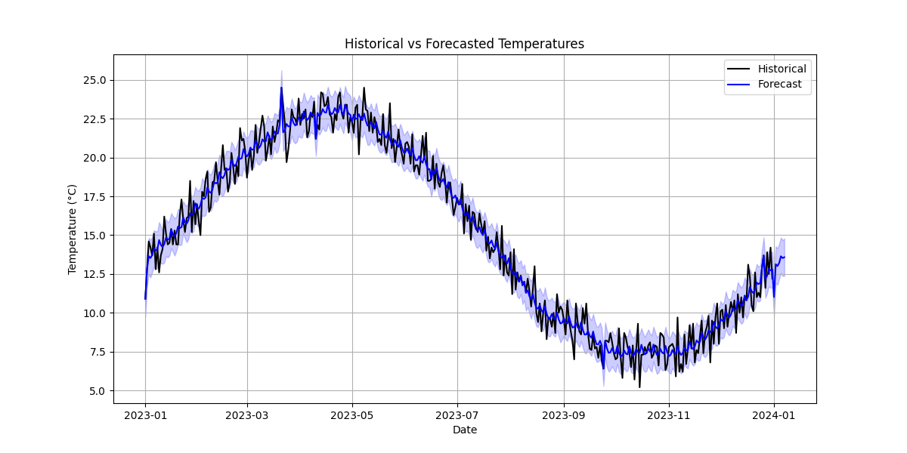
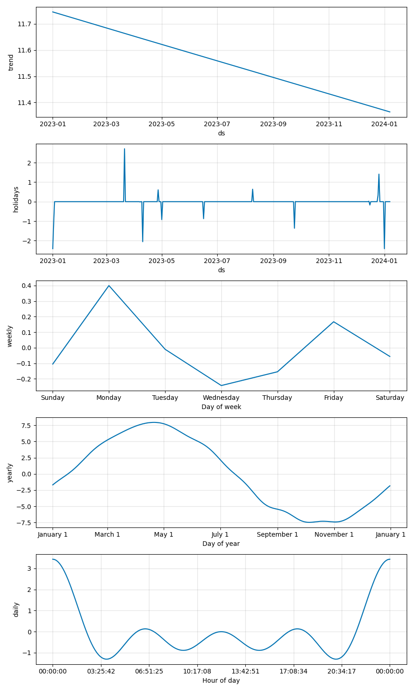

# Weather Forecast Program

## 📁 Submitted Files

- `forecast.py`: Updated python file
- `forecast.csv`: 7 days of forecasted weather data
- `forecast.png`: Visualization of Weather Forecasted for the next 7 days
- `forecast_actuals.png`: Visualization of Weather Forecasted for the next 7 days, including trailing last 7 days
- `forecast_actuals_full_range.png`: Visualization of Weather Forecasted for the entire training period
- `components.png`: Visualization of Components from the model. --plot-components should be passed in
- `test_weather_forecast.py`: Weather forecast python test file

